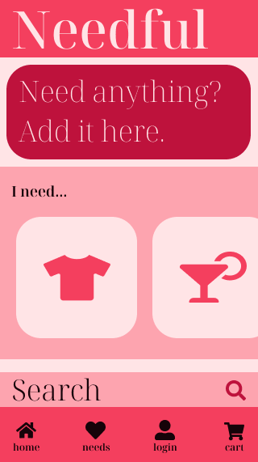
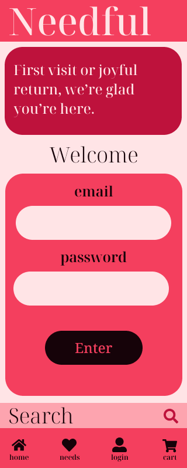
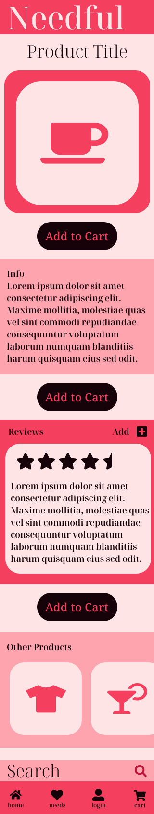
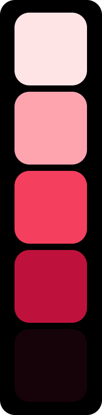
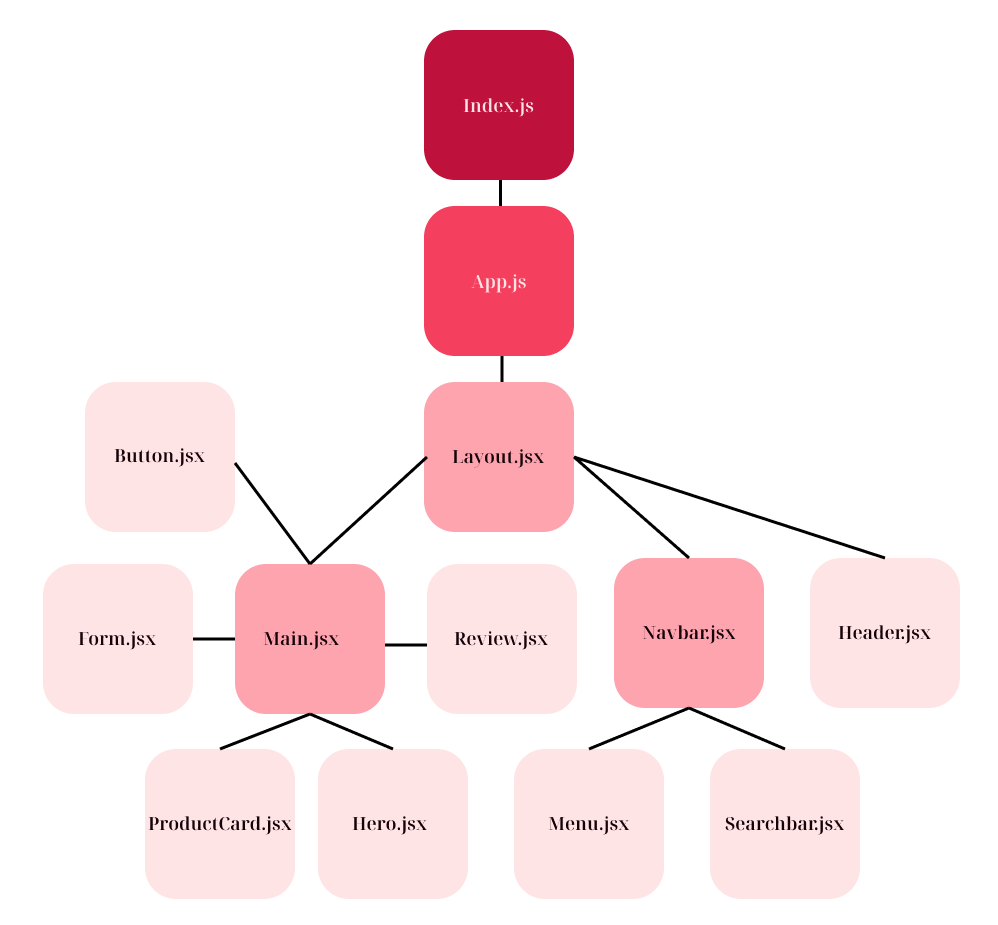
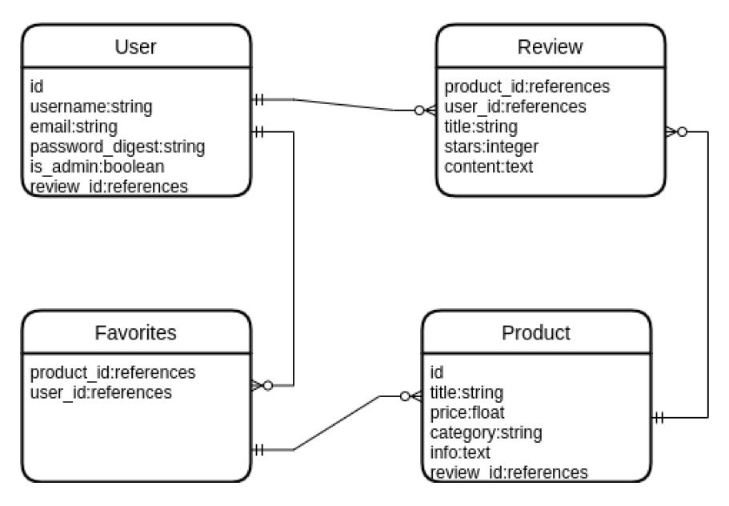

# **Needful**

## Overview
Needful is a functional CRUD application with an e-commerce UI.

## Minimum Viable Product (MVP)
### Features
- Mobile, medium and large desktop screen layouts
- Sticky header on top with site title
- Footer with with navbar and searchbar (on mobile)
- User authentication
    - Login/Signup page
    - Site will be usable without authentication (except creating reviews, and favorites)
- Favorites page with favorite products saved to user profile
    - User can create, read, and delete favorites
- Product detail page
    - User can CRUD their reviews for a product, and can index all reviews for a product
- Search page with list of products filtered by search term

### Goals
- Professional UI with backend support
- Simple and welcoming landing page
- Easy to navigate

### Challenges
- Seemless user authentication that does not detract from the UX
- Efficient data flow through app

## Dependencies
|  Dependency       | Description
| ---               | --- |
| [React](https://reactjs.org/)             | Front-End framework
| [React-Router](https://reactrouter.com/docs/en/v6)       | Routing library for react
| [Axios](https://axios-http.com/docs/intro)             | Promise-based HTTP client for Node.js
| [Tailwind CSS](https://tailwindcss.com/)      | CSS framework
| [Rails](https://rubyonrails.org/)             | Back-End framework
| [JWT](https://jwt.io/)               | Information security library

## Front-End (Client)

### Wireframes

### Landing Page


### Favorites


### Signup/Login


### Product Detail


### Search


# [Click here to interact with the mobile prototype!](https://www.figma.com/proto/M9wSQ8KucArHmTwo4EC40p/Needful?node-id=12%3A103&scaling=scale-down&page-id=0%3A1&starting-point-node-id=12%3A213)

### Color Pallets



###### [Created with Figma](https://figma.com/) 

### Component Hierarchy

###### [Component hierarchy created with Figma](https://www.figma.com/)

### Architecture
```
src/
|_components/
    |_Layout.jsx
    |_Navbar.jsx
    |_Menu.jsx
    |_Searchbar.jsx
    |_Header.jsx
    |_ProductCard.jsx
    |_Review.jsx
    |_Button.jsx
    |_Main.jsx
    |_Form.jsx
|_screens/
    |_Landing.jsx
    |_Favorites.jsx
    |_Auth.jsx
    |_ProductDetail.jsx
    |_Searching.jsx
    |_404.jsx
    |_.jsx
|_services/
    |_apiConfig.js
|_App.js
|_Index.js
```

## Server
### Entity Relationship Diagram (ERD)

###### [ERD created with Figma](https://www.figma.com/)

### Post-MVP
- Admin login that can CRUD all products
- Cart functionality and [Stripe](https://stripe.com/) integration.
- Ensure compatability with all browsers and screen sizes
- An arrow that appears in the lower right corner to instantly scroll back to the top
- Subtle animations
- Additional themes (Dark Mode, Colorblind Mode)

## Timeframes

| Component                 | Priority  | Estimated Time    | Curently Invested | Actual Time   |
| ---                       | :---:     |  :---:            | :---:             | :---:         |
| Initialize Rails App      |           |     1 hrs         |                   |               |
| Initialize react app      |           |     1 hrs         |                   |               |
| Rails Scaffold            |           |     2 hrs         |                   |               |
| Backend Controllers       |           |     3 hrs         |                   |               |
| User auth backend         |           |     4 hrs         |                   |               |
| Test Backend              |           |     2 hrs         |                   |               |
| React Architecture setup  |           |     2 hrs         |                   |               |
| API config                |           |     4 hrs         |                   |               |
| User auth frontend        |           |     4 hrs         |                   |               |
| CRUD favorites            |           |     3 hrs         |                   |               |
| CRUD reviews              |           |     3 hrs         |                   |               |
| Test frontend routes      |           |     3 hrs         |                   |               |
| Navbar functionality      |           |     2 hrs         |                   |               |
| Style navbar              |           |     4 hrs         |                   |               |
| Styling screens           |           |     6 hrs         |                   |               |
| Menu functionality        |           |     3 hrs         |                   |               |
| Style menu                |           |     3 hrs         |                   |               |
| Refactor code             |           |     5 hrs         |                   |               |
| CSS Polish                |           |     5 hrs         |                   |               |
| Total                     |           |     60 hrs        |                   |               |

## Project Schedule

|  Day  | Deliverable   | Status
| ---   | ---           | --- |
|Feb 23 | Prompt / README           | Complete
|Feb 24 | README / Pitch / Setup    | Complete
|Feb 25 | Back End MRC / Testing    | Complete
|Feb 26 | Backend Auth / Testing    | Complete
|Feb 27 | Front End MRC / Testing   | Complete
|Feb 28 | Front End Views           | Complete
|Mar 1  | Styling Polish            | Complete
|Mar 2  | Presentation              | Complete

## [Change Log](https://github.com/nickdbmiller/needful/commits/main)
